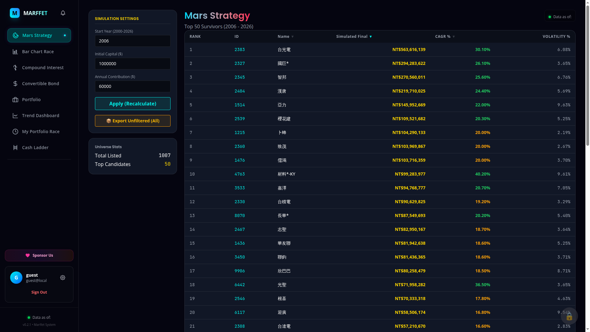
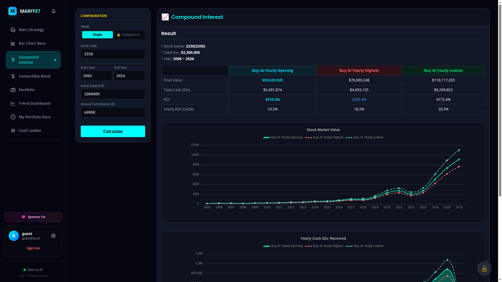
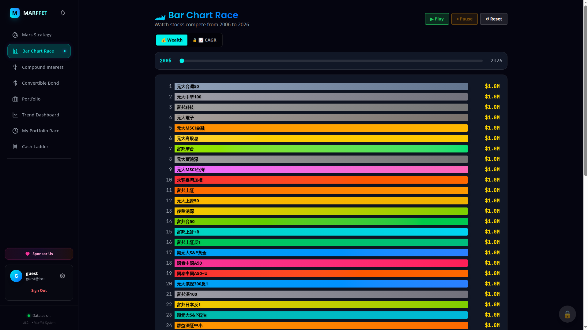

# 👽 Marffet Investment System

🌐 [繁體中文](./README-zh-TW.md) | [简体中文](./README-zh-CN.md)

**Your AI-powered investment companion.** Backtest strategies, track your portfolio, and compete on the leaderboard — all in a sleek, cyberpunk interface.

## 🌟 What Is Marffet?

Marffet is a web-based investment simulation and portfolio management tool that **proves "time in the market beats timing the market."** Watch 20+ years of Taiwan stock history unfold in dynamic visualizations, compare your performance against proven strategies, and get AI-powered insights.

**🔗 Try it now: [marffet-app.zeabur.app](https://marffet-app.zeabur.app)**

---

## 📸 App Preview

### Mars Strategy — Top 50 Survivors (2006–2026)

### Compound Interest Calculator

### Bar Chart Race — Watch History Unfold

---

## 🚀 Getting Started

### Access the App
- **URL**: [https://marffet-app.zeabur.app](https://marffet-app.zeabur.app)
- **Login**: Sign in with your **Google Account**
- **Guest Mode**: Explore the simulator and visualizations without creating an account

### First Steps
1. **Sign In** with Google
2. **Explore "Mars Strategy"** — see the top 50 stock survivors from 2006 to today
3. **Add Your Holdings** in the Portfolio tab
4. **Watch Your Race** — see your investments compete over time
5. **Customize** your profile, nickname, and settings via the ⚙️ icon

---

## 📊 Features

### 1. Mars Strategy Simulator 🪐
The core of Marffet. Simulates 20+ years of investment history to find the **Top 50 Survivors**.

- **Customizable**: Set your Start Year, Initial Capital, and Annual Contribution
- **Three Strategies**: Compare Buy-At-Opening (BAO), Buy-At-Highest (BAH), and Buy-At-Lowest (BAL)
- **Full Coverage**: TWSE stocks, TPEx/OTC, Bond ETFs (e.g., 00679B), and Convertible Bonds
- **Blazing Fast**: Results in under 200ms thanks to DuckDB + vectorized computation
- **Export**: Download Top 50 data as Excel spreadsheets

### 2. Bar Chart Race 🏎️
A dynamic animated visualization of stock performance racing over time.

- **Watch History Unfold**: See which stocks rise and fall year by year
- **Premium Feature**: CAGR metric toggle for advanced analysis

### 3. Compound Interest Calculator 💰
Simulate long-term compounding with single stocks or compare multiple assets side by side.

- **Single Mode**: Calculate compound growth for one stock with dividends reinvested
- **Comparison Mode**: Put up to 3 stocks head-to-head

### 4. Portfolio Tracker 📋
Manage your real investment portfolio with a sleek, "Webull-style" interface featuring full transaction history.

- **Visual Allocation**: ECharts donut charts and premium stats cards for quick insights
- **Groups**: Organize holdings into Dividend, Growth, Speculative, or custom categories
- **Transactions**: Log buys and sells with dates, shares, and prices
- **Real-Time Sync**: Pull current market data to calculate live P/L
- **Responsive UX**: 7-column stacked desktop view and cyberpunk framed mobile cards with smooth stagger animations

### 5. Portfolio Trend 📈
Your personal investment curve aligned with your transaction history.

- **Net Worth Over Time**: Visualize your portfolio growth month by month
- **Dividend Tracking**: Toggle dividend income as a separate chart layer
- **Realized & Unrealized P/L**: See both gains broken down

### 6. My Race 🏁
Your personal bar chart race — watch your own holdings compete against each other.

- **Animated Playback**: Play, pause, and scrub through time
- **Quarterly Resolution**: See shifts in your top performers each quarter

### 7. Cash Ladder (Leaderboard) 🏆
See how your ROI compares against other Marffet users.

- **Global Rankings**: Sorted by ROI percentage
- **Public Profiles**: View others' top holdings and allocation (without dollar amounts)
- **Sync Stats**: Update your ranking with one click

### 8. CB Strategy 🔧
Specialized tools for Convertible Bond investors.

- **Premium Monitoring**: Track CB premiums and identify arbitrage opportunities
- **Yield Hunter**: Alerts when premium falls below -1% (buy) or rises above 30% (sell)

### 9. Mars AI Copilot 🤖
An intelligent investment assistant powered by Google Gemini.

| | Free Tier | Premium Tier |
|:--|:--|:--|
| **Personality** | Encouraging Educator | Ruthless Wealth Manager |
| **Focus** | Explains why buy-and-hold works | Active rebalancing advice |
| **Advice** | General education | Sell overheated stocks, buy oversold ones |

---

## 💎 Membership Tiers

| Feature | Guest | FREE | PREMIUM | VIP | GM |
|:--------|:------|:-----|:--------|:----|:---|
| Mars Strategy | ✅ | ✅ | ✅ | ✅ | ✅ |
| Bar Chart Race | Basic | Basic | Advanced (CAGR) | Advanced (CAGR) | Full |
| Compound Interest (Single) | ✅ | ✅ | ✅ | ✅ | ✅ |
| Compound Interest (Comparison) | 🔒 | 🔒 | ✅ | ✅ | ✅ |
| Portfolio Groups | 3 max | 11 max | 20 max | 30 max | ∞ |
| Targets per Group | 10 max | 50 max | 100 max | 200 max | ∞ |
| Transactions per Target | 10 max | 100 max | 500 max | 1,000 max | ∞ |
| AI Copilot | ❌ | 🎓 Educator | 🎓 Educator | 💼 Wealth Manager | Full |
| CB Notifications | ❌ | ❌ | ✅ In-App | ✅ In-App + Email | Full |
| Rebalancing Alerts | ❌ | ❌ | ✅ In-App | ✅ In-App + Email | Full |
| Data Export | ❌ | 📦 Unfiltered | 📥 Filtered + 📦 Unfiltered | 📥 Filtered + 📦 Unfiltered | Full |
| Server-Side Data | ❌ | ✅ | ✅ | ✅ | ✅ |
| Priority Support | ❌ | ❌ | ❌ | ✅ | ✅ |
| Early Access | ❌ | ❌ | ❌ | ✅ | ✅ |
| Admin Dashboard | ❌ | ❌ | ❌ | ❌ | ✅ |

> **How to upgrade?** Go to ⚙️ Settings → Sponsor Us → choose Ko-fi or Buy Me a Coffee. The GM will inject your membership!

---

## ☕ Sponsorship & Memberships

Love the Marffet Investment System? You can sponsor our development and unlock **Premium** or **VIP** features!

1. Go to **Settings** ⚙️ and click the **Sponsor Us** tab.
2. Choose your preferred platform: [Ko-fi](https://ko-fi.com/terranandes) or [Buy Me a Coffee](https://buymeacoffee.com/terranandes).
3. Once sponsored, our Game Master (GM) will manually inject your Premium or VIP membership into your account.

---

## 🛠 Need Help?

- **Found a Bug?** Use the ⚙️ Settings panel in the app to report it
- **Feature Request?** Send your ideas through the same Settings panel
- **Questions?** Check the in-app documentation page (/doc) for a quick overview of all features

---

*Built with ❤️ by the Marffet AI Team • v5.1*
