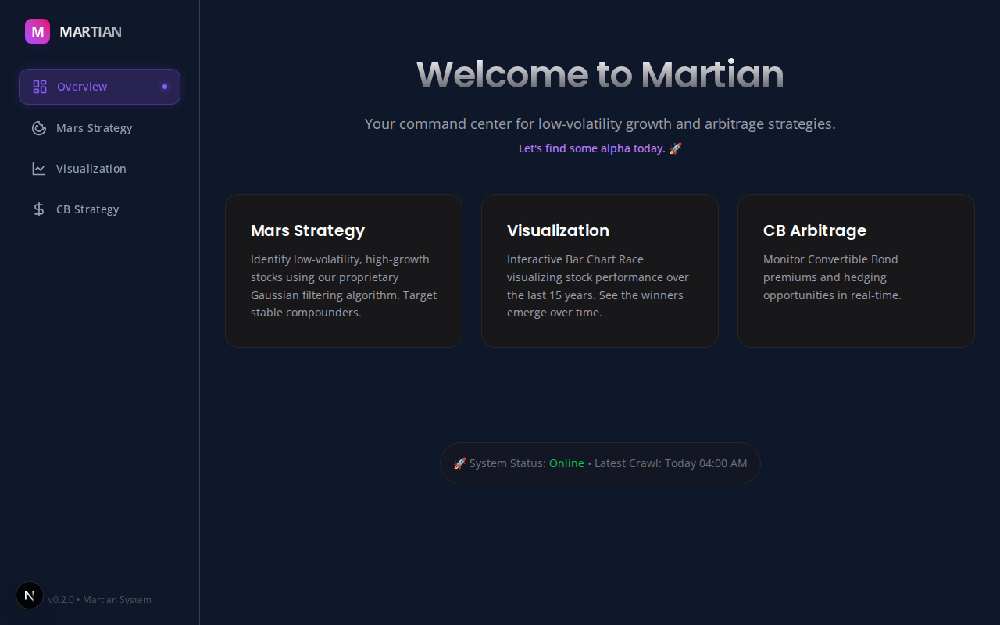

# Martian Investment System 🚀

A full-stack quantitative stock analysis platform verifying that **"Time in the market beats timing the market."**

Gamify your long-term investing by racing against the mechanized **Mars Strategy** and see if you can beat the market!



## ✨ Features

-   **Mars Strategy**: Automatic filtering of low-volatility, high-CAGR stocks (Gaussian Filter).
-   **CB Arbitrage**: Real-time evaluation of Convertible Bond conversion premium signals.
-   **Market Visualization**: Interactive **Bar Chart Race** of stock performance over time.
-   **Modern UI**: Built with Next.js and TailwindCSS for a premium experience.
-   **Robust Backend**: Powered by FastAPI and AsyncIO for efficient data crawling.
-   **Extreme Speed**: Leverages an in-memory DuckDB singleton cache to resolve 20-year calculations in `<200ms`.
-   **Dynamic Naming**: Real-time synchronization with official TWSE/TPEX stock names.

---

## ☁️ Run on GitHub (Codespaces)

**You can run this full application directly in your browser without installing anything!**

1.  Click the **"Code"** button (green) at the top of this repository.
2.  Select **"Codespaces"** tab -> **"Create codespace on main"**.
3.  Wait for the environment to build.
4.  In the terminal, run:
    ```bash
    ./start_app.sh
    ```
5.  VS Code will show a popup: *"Your application running on port 5173 is available."*
6.  Click **"Open in Browser"**.
7.  🎉 The App is now running in the cloud!

---

## 💻 Local Installation

If you prefer to run it on your own machine:

### Prerequisites
-   Python 3.12 (Managed by `uv`)
-   **Bun** 1.x (Frontend Runtime)

### Setup (Required: uv)

We use `uv` for 10x faster setup and reliable dependency management.

1.  **Clone the repo**:
    ```bash
    git clone https://github.com/your-username/martian.git
    cd martian
    ```

2.  **Initialize & Run**:
    ```bash
    # Install uv (if you haven't yet)
    # curl -LsSf https://astral.sh/uv/install.sh | sh
    
    # Run the app directly
    ./start_app.sh
    ```
    *Open `http://localhost:8000` in your browser.*

4.  **Important**: Google Sign-In requires your `GOOGLE_CLIENT_ID` and `SECRET` in `.env`.
    *   Ensure your Google Cloud Console has `http://localhost:8000/auth/callback` added to "Authorized Redirect URIs".
    *   If you see `Error 400: redirect_uri_mismatch`, check if you are accessing via `127.0.0.1` vs `localhost`.

**Q: Can I host this on GitHub Pages?**
A: **Partially.** GitHub Pages only hosts static websites (HTML/JS). This app requires a Python backend to fetch stock data (TWSE) and calculate metrics.
-   If you deploy *only* the Frontend to GitHub Pages, it will show the UI, but **all analysis features will fail** because there is no backend API to talk to.

**Q: Where should I deploy it?**
A: We recommend using a service that supports Docker or Python/Node apps, such as:
-   **Zeabur**
-   **Render** (Free tier available)
-   **Railway**
-   **Heroku**
-   **AWS / GCP**

---

## 🛠 Tech Stack

-   **Frontend**: Next.js 16 (React 18), TailwindCSS, ECharts, Framer Motion.
-   **Backend**: FastAPI, Uvicorn, Python 3.12.
-   **Data**: AsyncIO Crawler (TWSE), Pandas (Analysis).
