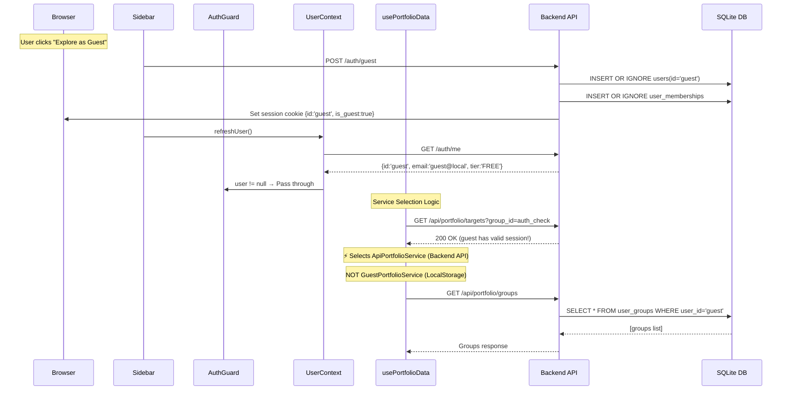

# Guest Mode Architecture: Investigation & Brainstorming

**Date:** 2026-03-13
**Agents:** [PL], [CV]
**Trigger:** E2E test failure during group creation + question about Guest Mode data storage

---

## 🔍 INVESTIGATION: Current Implementation (As-Is)

### Terran's Question

> "Does guest not use the DB as a shared guest account? What is the current implementation?"

### Answer: YES, Guest DOES use the DB. My previous statement was WRONG

After thorough code investigation, here is the **actual** Guest Mode architecture:

---

### Data Flow Diagram



### Key Source Files

| Component | File | Role |
|---|---|---|
| Backend Guest Login | `app/auth.py:341-365` | Creates REAL DB user + session |
| Frontend User State | `frontend/src/lib/UserContext.tsx` | Manages user auth state via `/auth/me` |
| Auth Guard | `frontend/src/components/AuthGuard.tsx` | Blocks pages if `user == null` |
| Sidebar Guest Button | `frontend/src/components/Sidebar.tsx:346-374` | `POST /auth/guest` → `refreshUser()` |
| Service Selector | `frontend/src/app/portfolio/hooks/usePortfolioData.ts:30-49` | Picks API vs LocalStorage |
| API Service | `frontend/src/services/portfolioService.ts:85-289` | Real API calls |
| LocalStorage Service | `frontend/src/services/portfolioService.ts:300-522` | Client-only fallback |
| Portfolio Factory | `frontend/src/services/portfolioService.ts:526-529` | `isLoggedIn ? Api : Guest` |

---

## 🧠 Architectural Analysis

### The TWO Guest Modes (Design Disconnect)

There are actually **two completely different Guest modes** in the codebase:

| Aspect | Mode A: "Backend Guest" (ACTIVE) | Mode B: "LocalStorage Guest" (DORMANT) |
|---|---|---|
| **Triggered when** | User clicks "Explore as Guest" → `/auth/guest` succeeds | API is unreachable (network error, no backend) |
| **Session** | Real backend session (cookie) | No session |
| **User in DB** | `users` table: `id='guest'` | No DB entry |
| **Data storage** | SQLite `portfolio.db` (shared!) | Browser `localStorage` |
| **Service class** | `ApiPortfolioService` | `GuestPortfolioService` |
| **isGuest flag** | `false` (!) | `true` |
| **"Guest Mode" badge** | **NOT shown** (!) | Shown |
| **Data persists** | Across browsers, shared by ALL guests | Per-browser only |

### Critical Findings

1. **`isGuest` flag is misleading**: In `usePortfolioData.ts`, `isGuest` is only `true` when the API returns 401/403 or is unreachable. Since the guest has a valid session, `isGuest = false`.

2. **"Guest Mode" badge is never shown** for the actual Guest flow, because `PortfolioHeader` only shows it when `isGuest === true`.

3. **Guest data is SHARED**: All "guests" share the same `user_id='guest'` in the DB. If User A creates a group as guest, User B logging in as guest will see it too.

4. **The GuestPortfolioService (LocalStorage) is dead code** in the normal Guest flow. It only activates as a last-resort offline fallback.

---

## 🔴 Root Cause of E2E Failure

Given that Guest Mode uses the **Backend API**, the group creation flow is:

```
1. Click "+ New Group" → shows input form (showAddForm toggle)
2. Type name → press Enter/click Create
3. handleCreate() → createGroup(name) → service.createGroup(name)
4. ApiPortfolioService.createGroup() → POST /api/portfolio/groups
5. On success → mutateGroups() (SWR revalidation)
6. SWR refetches groups → UI re-renders with new group tab
```

**The most likely failure point:** Step 4 or 5.

- The `POST /api/portfolio/groups` might be failing silently (empty `catch {}` block)
- Or `mutateGroups()` is not properly revalidating from the backend
- The E2E test sees "+ New Group" but the actual group creation API call fails

**Previous DB cleanup was CORRECT** — we were deleting from the right place (`user_groups WHERE user_id = 'guest'`). But the cleanup was removing groups BEFORE log-in, while the test might have been creating them via the wrong service.

---

## 🧩 Brainstorming: Options Forward

### Option A: Fix the E2E test to verify the API call

**Approach:** Intercept the `POST /api/portfolio/groups` network request in Playwright to confirm it succeeds.

| Pros | Cons |
|---|---|
| Directly exposes the root cause | Doesn't fix any architectural issue |
| Minimal code changes | Still flaky if backend has race conditions |
| Fast to implement | |

**If not specified:** This is the quickest path to a green E2E suite.

### Option B: Add proper isGuest detection for Backend Guest

**Approach:** Pass `is_guest: true` from `/auth/me` and use it in `usePortfolioData` to show the "Guest Mode" badge correctly.

| Pros | Cons |
|---|---|
| Fixes misleading UI state | Requires backend + frontend changes |
| Badge shown correctly | May affect other components |
| Better UX | |

### Option C: Completely isolate Guest Mode to LocalStorage (remove DB guest)

**Approach:** Remove `/auth/guest` DB flow, use pure client-side `GuestPortfolioService`.

| Pros | Cons |
|---|---|
| No shared guest data pollution | Loses portfolio API features (dividends, prices) |
| Truly isolated guest experience | Need separate price endpoint (already public) |
| Simpler architecture | Data lost on browser clear |

### Option D: Keep dual-mode but make E2E test explicitly use Backend Guest

**Approach:** E2E test acknowledges guest uses backend API. Test the actual API round-trip.

| Pros | Cons |
|---|---|
| Tests real production behavior | Requires DB cleanup before/after |
| No architecture changes needed | Shared guest data could interfere |
| Most accurate E2E verification | |

---

## 🎯 Recommended Path

**Option D (immediate) + Option B (follow-up)**

1. **Immediate fix:** Update E2E test to properly test Backend Guest mode, including network request verification
2. **Follow-up:** Add `is_guest` detection so the UI properly reflects Guest state

---

## ❓ Questions for Terran Before Proceeding

### [P0] **Intent of Guest Mode**

**Question:** Should "Guest Mode" be a shared backend user (`user_id='guest'`, data in DB) or an isolated browser-only experience (data in localStorage)?

**Why This Matters:**

- Shared DB guest means ALL anonymous users share the same portfolio data
- Browser-only guest means data is private but ephemeral
- This fundamentally changes how we test and what we test

**Options:**

| Option | Data Location | Shared? | Persists? | Best For |
|---|---|---|---|---|
| Backend Guest (current) | SQLite DB | Yes, all guests share | Yes, server-side | Demo/showcase scenarios |
| LocalStorage Guest | Browser | No, per-browser | Until clear | Privacy-first UX |
| Hybrid: Backend session + LocalStorage data | Browser | No | Until clear | Best of both? |

### [P1] **E2E Test Scope**

**Question:** Should E2E tests verify the full backend round-trip for guest, or is testing the UI interaction sufficient?

**If Not Specified:** I'll test the full backend round-trip since that's the actual production behavior.
