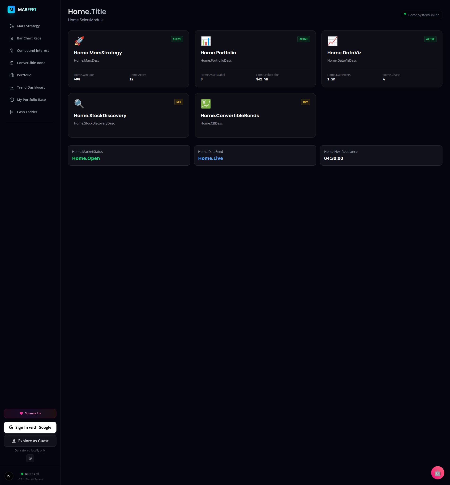

# BUG-012-CV: Home Page i18n Translation Keys Displayed Raw

**Reporter:** [CV] Agent
**Date:** 2026-03-04
**Severity:** Medium
**Priority:** Low (cosmetic, pre-existing)
**Status:** OPEN

## Description
The Home landing page (`/`) displays raw i18n translation keys instead of translated text.

**Affected keys:**
- `Home.Title`
- `Home.SelectModule`
- `Home.MarsStrategy`, `Home.MarsDesc`
- `Home.Portfolio`, `Home.PortfolioDesc`
- `Home.DataViz`, `Home.DataVizDesc`
- `Home.StockDiscovery`, `Home.StockDiscoveryDesc`
- `Home.ConvertibleBonds`, `Home.CBDesc`
- `Home.MarketStatus`, `Home.Open`
- `Home.DataFeed`, `Home.Live`
- `Home.WinRate`, `Home.Active`, `Home.AssetsLabel`, `Home.ValueLabel`
- `Home.DataPoints`, `Home.Charts`
- `Home.SystemOnline`, `Home.NextRebalance`

## Root Cause
These keys are used in the `page.tsx` (or a Home component) via `t('Home.xxx')` but **none of these keys exist in the locale file** `/frontend/src/lib/i18n/locales/en.json`.

## Impact
- All visitors see raw dot-notation keys instead of English text on the home page
- Other tab pages (Mars, Compound, Portfolio, etc.) display translations correctly
- Brand name "MARFFET" renders fine from sidebar

## Reproduction
1. Navigate to `http://localhost:3000`
2. Observe raw keys like `Home.Title`, `Home.MarsStrategy`

## Evidence

## Classification
**Pre-existing gap** — not a regression from the tier differentiation (Phase 26) or color fix changes. The Home page keys were likely added during a UI refactor but the locale dictionaries were never updated.

## Fix
Add all `Home.*` keys to `en.json`, `zh-TW.json`, and `zh-CN.json` locale files.
