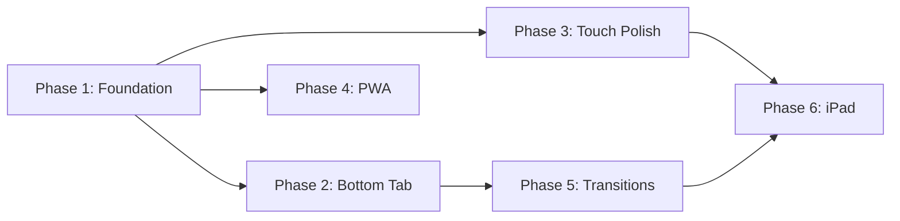

# Mobile App-Like Experience — Implementation Plan

> **For Claude:** REQUIRED SUB-SKILL: Use superpowers:executing-plans to implement this plan task-by-task.

**Goal:** Transform the Marffet mobile web experience into a native-app-like PWA — with bottom tab navigation, touch-optimized layouts, smooth page transitions, "Add to Home Screen" support, and responsive design from iPhone SE (375px) through iPad Pro (1024px+).

> [!IMPORTANT]
> **Strategic Context (過渡期):** This mobile web polish is a **transitional phase** before a potential future native mobile app (React Native / Flutter). The patterns established here (bottom tab bar, touch targets, responsive breakpoints) will directly inform the native app's design system. PWA gives us an app-like experience now without the cost of native development.

**Architecture:** Progressive enhancement on the existing Next.js 16 + React 19 + Tailwind stack. No new frameworks. Mobile-first CSS overhaul using responsive breakpoints, a new bottom tab bar component for mobile, Framer Motion page transitions, and PWA manifest + service worker for installability.

**Tech Stack:** Next.js 16, React 19, Tailwind CSS, Framer Motion (already installed), `next-pwa` or manual manifest, ECharts responsive options.

---

## Current State Analysis

| Aspect | Current | Target |
|--------|---------|--------|
| **Navigation** | Desktop sidebar (hamburger on mobile) | Bottom tab bar on mobile, sidebar on desktop/iPad |
| **Layout breakpoint** | `md:` (768px) for margin, `lg:` (1024px) for flex | 3-tier: phone (<768), tablet (768-1023), desktop (1024+) |
| **Touch targets** | Desktop-sized buttons (varies) | Minimum 44×44px per Apple HIG |
| **PWA** | None (no manifest, no service worker) | Full PWA: manifest, icons, splash, installable |
| **Page transitions** | Hard cuts | Framer Motion fade/slide |
| **Charts** | Desktop-optimized ECharts | Responsive ECharts with mobile options |
| **Tables** | Horizontal scroll | Card layout on phone, table on tablet+ |
| **Landscape** | 未考慮（橫向模式：手機橫放時的畫面）| 暫不優先，但不破壞 |

---

## Phase 1: Foundation — Responsive Breakpoint System & Layout Fix

**Estimated Effort:** 1 session

### Task 1.1: Fix Root Layout Breakpoints

**Files:**
- Modify: `frontend/src/app/layout.tsx`
- Modify: `frontend/src/app/globals.css`

**Changes:**
1. Change `md:ml-64` → `lg:ml-64` in layout so sidebar margin only applies at 1024px+ (desktop)
2. Change `md:p-8` → `p-4 lg:p-8` for consistent mobile padding
3. Add CSS custom properties for responsive spacing tokens:
   ```css
   :root {
     --spacing-page: 1rem;      /* phone */
   }
   @media (min-width: 768px) {
     :root { --spacing-page: 1.5rem; }  /* tablet */
   }
   @media (min-width: 1024px) {
     :root { --spacing-page: 2rem; }    /* desktop */
   }
   ```
4. Add `viewport-fit=cover` meta tag for notched iPhones
5. Add `<meta name="apple-mobile-web-app-capable" content="yes">`
6. Add `safe-area-inset-top` padding for notched iPhones in PWA mode

### Task 1.2: Sidebar Breakpoint Alignment

**Files:**
- Modify: `frontend/src/components/Sidebar.tsx`

**Changes:**
1. Ensure sidebar is **always hidden** below `lg:` (1024px), not `md:` (768px)
2. This means tablets (768-1023px) will use the same mobile nav as phones
3. Update all `md:` references to `lg:` within Sidebar

---

## Phase 2: Bottom Tab Bar — Mobile Navigation

**Estimated Effort:** 1-2 sessions

### Task 2.0: Lift Auth State to Shared Context

**Files:**
- Modify: `frontend/src/components/ClientProviders.tsx`
- Modify: `frontend/src/components/Sidebar.tsx`

**Changes:**
1. Move `fetchData` / `user` / `isLoading` state from Sidebar into ClientProviders as a shared React context (`UserContext`)
2. Sidebar and BottomTabBar both consume `useUser()` from this context
3. This prevents auth state duplication between the two navigation components

> **Review note (S1):** Without this, BottomTabBar and Sidebar would each independently fetch `/auth/me`, causing inconsistent state.

### Task 2.1: Create BottomTabBar Component

**Files:**
- Create: `frontend/src/components/BottomTabBar.tsx`

**Design:**
- Fixed bottom bar, height ~60px + safe-area-inset-bottom
- 5 primary tabs: **Mars** | **Portfolio** | **Race** | **Trend** | **More**
- Active tab: cyan glow + filled icon
- **Always show text labels under icons** (not icon-only)
- "More" opens a simple popup overlay with remaining links
- Uses `usePathname()` for active state detection
- Only visible on screens < 1024px (`lg:hidden`)
- `pb-[env(safe-area-inset-bottom)]` for iPhone notch

### Task 2.2: "More" Popup Overlay

**Files:**
- Create: `frontend/src/components/MoreDrawer.tsx`

**Design:**
- Simple popup overlay sliding up from bottom (Framer Motion `animate={{ y: 0 }}`)
- Contains remaining nav items: Compound Interest, CB, Cash Ladder, My Race, Admin (if admin), Settings
- Backdrop overlay with blur
- Tap backdrop or any link to dismiss (no swipe gesture in v1)

> **Review note (S2):** Simplified from swipe-to-dismiss drawer to a simple popup. YAGNI — swipe gestures are complex on iOS Safari and can be added later.

### Task 2.3: Remove Mobile Hamburger, Integrate BottomTabBar

**Files:**
- Modify: `frontend/src/app/layout.tsx`
- Modify: `frontend/src/components/Sidebar.tsx`

**Changes:**
1. Add `<BottomTabBar />` to layout, inside the flex container
2. Hide hamburger menu on all viewports (it's replaced by bottom tabs on mobile, sidebar on desktop)
3. Add `pb-20 lg:pb-0` to main content area to avoid overlap with bottom tab bar
4. Keep sidebar for `lg:` (desktop/large tablet) only

---

## Phase 3: Touch Target & Spacing Polish

**Estimated Effort:** 1 session

### Task 3.1: Global Touch Target Minimums

**Files:**
- Modify: `frontend/src/app/globals.css`

**Changes:**
Add global mobile touch target rules:
```css
@media (max-width: 1023px) {
  button, a, [role="button"] {
    min-height: 44px;
    min-width: 44px;
  }
}
```

### Task 3.2: Compact Horizontal-Scroll Tables

**Files:**
- Modify: `frontend/src/app/mars/page.tsx` (Mars Strategy table)
- Modify: `frontend/src/app/trend/page.tsx` (Trend table)
- Modify: `frontend/src/app/ladder/page.tsx` (Cash Ladder table)

**Pattern:** On `< lg:` screens, keep data as a **compact table** with horizontal scroll and sticky first column (Rank + Ticker), instead of converting to cards:
```
┌──────┬──────────────────────────────────┐
│ #1   │  2383  台光電  NTS 1,234,567 ...→ │
│ #2   │  2327  國巨*   NTS   987,654 ...→ │
└──────┴──────────────────────────────────┘
  sticky    ← horizontal scroll →
```

> **Review note (S4):** Card layout was rejected — it breaks comparative scanning for ranked data. Sticky-column scroll tables are the standard mobile pattern for tabular data.

### Task 3.3: ECharts Responsive Configuration

**Files:**
- Modify: All pages using ECharts (race, trend, compound, portfolio, admin)

**Changes:**
- Add `responsive: true` media query options to ECharts
- Reduce grid padding on mobile
- Reduce font sizes in legends/axes
- Enable `dataZoom: [{ type: 'inside' }]` for touch pinch-zoom on charts

---

## Phase 4: PWA — "Add to Home Screen" & Installability

**Estimated Effort:** 1 session

### Task 4.1: Create Web App Manifest

**Files:**
- Create: `frontend/public/manifest.json`

```json
{
  "name": "Marffet Investment System",
  "short_name": "Marffet",
  "description": "Advanced Low-Volatility Stock Analysis & Portfolio Tracking",
  "start_url": "/mars",
  "display": "minimal-ui",
  "background_color": "#0a0e17",
  "theme_color": "#00e5ff",
  "orientation": "portrait-primary",
  "icons": [
    { "src": "/icons/icon-192.png", "sizes": "192x192", "type": "image/png" },
    { "src": "/icons/icon-512.png", "sizes": "512x512", "type": "image/png" },
    { "src": "/icons/icon-maskable-512.png", "sizes": "512x512", "type": "image/png", "purpose": "maskable" }
  ]
}
```

### Task 4.2: Generate PWA Icons & Apple Touch Icons

**Files:**
- Create: `frontend/public/icons/icon-192.png`
- Create: `frontend/public/icons/icon-512.png`
- Create: `frontend/public/icons/icon-maskable-512.png`
- Create: `frontend/public/apple-touch-icon.png` (180×180)

**Method:** Generate from existing `M` logo using the `generate_image` tool.

### Task 4.3: Link Manifest & Meta Tags in Layout

**Files:**
- Modify: `frontend/src/app/layout.tsx`

**Changes:**
```tsx
// In metadata export:
manifest: "/manifest.json",
appleWebApp: {
  capable: true,
  statusBarStyle: "black-translucent",
  title: "Marffet",
},
```

### Task 4.4: Service Worker (Minimal Offline Shell)

**Files:**
- Create: `frontend/public/sw.js`

**Scope:** Cache the app shell (HTML, CSS, JS bundles) for offline launch. API data remains online-only. This gives the "instant launch" feel without complex offline data management.

> **Review note (S3):** Must use versioned cache names + `skipWaiting()` + `clients.claim()` to prevent stale deploys after Zeabur updates.

> **Review note (C2):** Using `"display": "minimal-ui"` instead of `"standalone"` preserves the browser's minimal chrome, allowing users to "Request Desktop Site" on mobile. This aligns with the user's requirement that adaptive display is opt-in and desktop view remains accessible.

---

## Phase 5: Page Transitions & Animations

**Estimated Effort:** 1 session

### Task 5.1: Page Transition Wrapper

**Files:**
- Create: `frontend/src/components/PageTransition.tsx`

**Design:**
- Framer Motion `AnimatePresence` wrapper
- Fade + subtle slide-up on page enter
- Applied in `layout.tsx` around `{children}`

### Task 5.2: Micro-Interactions

**Files:**
- Modify: Various page components

**Changes:**
- Button press scale effect (`active:scale-95`) globally
- Pull-to-refresh feel on data pages (visual only, not actual PTR)
- Haptic feedback on iOS via `navigator.vibrate` where supported

---

## Phase 6: iPad / Tablet Optimization

**Estimated Effort:** 1 session

### Task 6.1: Tablet Layout (768-1023px)

**Files:**
- Modify: `frontend/src/app/layout.tsx`
- Modify: Various page components

**Design decisions:**
- 768-1023px: Bottom tab bar + 2-column grid layouts where appropriate
- Tables stay as tables (enough horizontal room)
- Charts get medium-sized responsive options
- This is the "tablet sweet spot" — more space than phone, but no sidebar

### Task 6.2: iPad Pro (1024px+)

- Already handled by existing `lg:` breakpoint → desktop sidebar layout
- No additional work needed; iPad Pro in landscape = desktop experience

---

## Verification Plan

### Automated Tests
```bash
# Run existing E2E suite at mobile viewport
cd /home/terwu01/github/marffet
python tests/e2e/e2e_suite.py --viewport 375x667

# Run mobile-specific test
python tests/unit/test_mobile_portfolio.py
```

### Manual Verification Matrix

| Device | Viewport | Test |
|--------|----------|------|
| iPhone SE | 375×667 | Bottom tabs, card layout, PWA install |
| iPhone 14 Pro | 393×852 | All pages, safe area, notch |
| Android Pixel 7 | 412×915 | Bottom tabs, transitions |
| iPad Mini | 768×1024 | Tablet layout, 2-col grid |
| iPad Pro 12.9" | 1024×1366 | Desktop sidebar (landscape) |

### PWA Verification
1. Open in Safari iOS → Share → Add to Home Screen
2. Launch from Home Screen → verify standalone mode
3. Verify splash screen and theme color
4. Open Chrome Android → verify install prompt

---

## Execution Order & Dependencies



**Critical Path:** Phase 1 → Phase 2 → Phase 5
**Parallel:** Phase 3 and Phase 4 can run independently after Phase 1

---

*Plan created: 2026-03-05 by [PL]*
*Skill: writing-plans*
