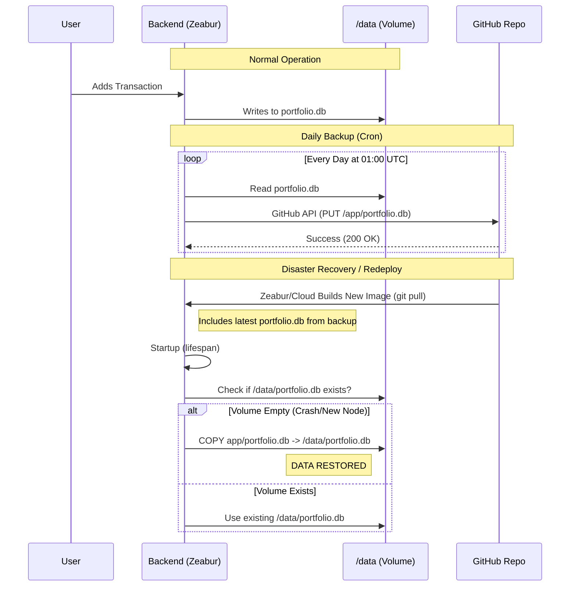

# Database Backup & Recovery Specification

## 1. Overview
The Martian Investment System uses a lightweight SQLite database (`portfolio.db`) to store user data (portfolios, groups, transactions). 

Since the application runs on **Ephemeral Cloud Containers** (e.g., Zeabur, Render), the filesystem is not persistent across deployments or crashes unless a specific Persistent Volume is mounted.

To ensure **Data Resilience** without complex external database services (like AWS RDS), we implemented a **"Uni-directional Git Backup Loop"**.

---

## 2. Architecture Diagram

---

## 3. The Flow in Detail

### Phase A: Runtime Persistence
- **Storage**: The active database is located at `/data/portfolio.db`.
- **Mechanism**: We mount a persistent volume at `/data` in Zeabur.
- **Risk**: If the volume mapping disconnects, breaks, or the deployment moves to a region where the volume isn't synced, `/data` might be empty on startup.

### Phase B: Automated Backup (The Safety Net)
- **Trigger**: `APScheduler` runs daily at **09:00 Taipei Time (01:00 UTC)**.
- **Action**: 
    1. Reads the binary file `/data/portfolio.db`.
    2. Encodes it to Base64.
    3. Uses the **GitHub Content API** to commit the file directly to your repository at path `app/portfolio.db`.
- **Result**: Your GitHub repository always contains a snapshot of the database from the last backup.

### Phase C: Crash Recovery (Restore on Startup)
- **Scenario**: The application crashes and restarts, or is redeployed.
- **Boot Logic (`lifespan` in `main.py`)**:
    1. System checks if `/data/portfolio.db` exists.
    2. **IF MISSING**: It assumes a crash/dataloss event.
    3. **ACTION**: It performs a copy: `cp /app/portfolio.db /data/portfolio.db`.
    4. **Source**: The `/app/portfolio.db` comes from the git repository (the Docker image), which was updated by Phase B.
    
**This creates a self-healing loop:** 
Data -> Backup to Git -> Redeploy pulls from Git -> Restores Data.

---

## 4. Configuration

To enable this flow, the Backend service requires specific environment variables to authenticate with GitHub.

| Variable | Description | Example |
| :--- | :--- | :--- |
| `GITHUB_TOKEN` | Personal Access Token (classic) with `repo` scope permission. | `ghp_A1b2...` |
| `GITHUB_REPO` | The `username/repository` string. | `terranandes/martian` |

---

## 5. Security Note
- **Private Repo**: Ensure your GitHub repository is **Private**. The database contains user transaction info.
- **Token Scope**: The PAT only needs `repo` (Full control of private repositories) scope to push the file.
