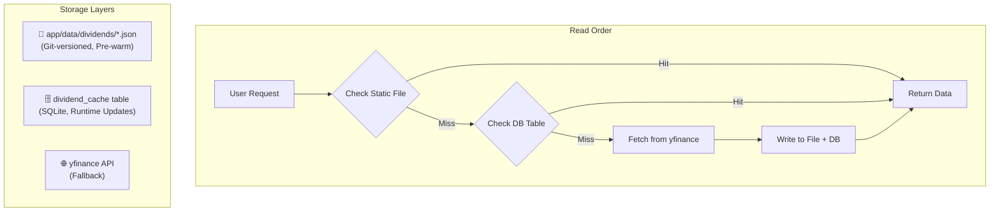
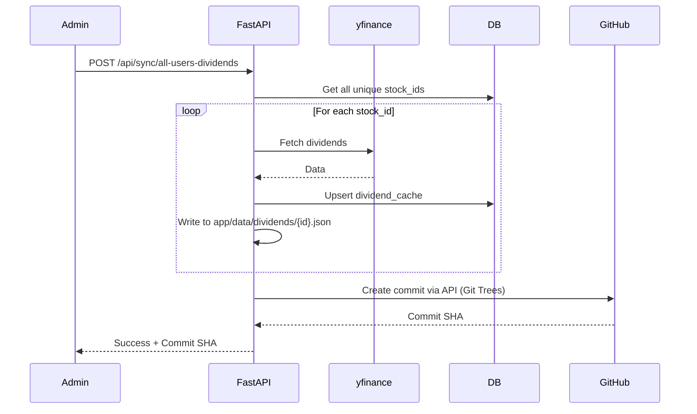

# Dividend Cache Architecture & Sync Specification

**Status**: [SPEC] Technical Specification  
**Date**: 2026-01-29  
**Module**: `app/dividend_cache.py`, `app/services/backup.py`, `app/routers/sync.py`

---

## 1. Overview

The Dividend Cache provides **pre-fetched historical dividend data** for all user-held stocks. This eliminates runtime API calls to `yfinance` during portfolio calculations, reducing Trend page load time from ~10s to <1s.

### Design Goals
1. **Speed**: Serve dividend data from local storage (no external API latency).
2. **Persistence**: Survive Zeabur container restarts and redeployments.
3. **Correctness**: Allow manual sync when new dividends are announced.
4. **Auditability**: Version control cache files via Git.

---

## 2. Hybrid Storage Architecture



### 2.1 Storage Layer Details

| Layer | Location | Persistence | Speed | Use Case |
|-------|----------|-------------|-------|----------|
| **Static Files** | `app/data/dividends/{stock_id}.json` | Git (Survives redeploy) | Fastest | Pre-warmed cache for popular stocks |
| **DB Table** | `portfolio.db` → `dividend_cache` | Zeabur Volume | Fast | Runtime updates, survives container restart |
| **yfinance** | External API | None | ~2s/stock | Fallback only, triggers cache write |

### 2.2 JSON File Format
```json
{
  "stock_id": "2330",
  "stock_name": "台積電",
  "last_synced": "2026-01-29T14:00:00Z",
  "dividends": [
    {"date": "2025-12-11", "amount": 5.0},
    {"date": "2025-09-16", "amount": 5.0}
  ]
}
```

### 2.3 DB Schema
```sql
CREATE TABLE IF NOT EXISTS dividend_cache (
    stock_id TEXT PRIMARY KEY,
    stock_name TEXT,
    last_synced TEXT,
    dividends_json TEXT  -- JSON array string
);
```

---

## 3. Sync Mechanisms

### 3.1 User Sync (Per-User Scope)
- **Trigger**: User clicks "🔄 Sync My Dividends" on Trend page.
- **Scope**: Only stocks in user's current portfolio.
- **Action**: 
  1. Fetch from `yfinance`.
  2. Write to File + DB.
  3. **No Git push** (saves bandwidth, user-level changes are local).
- **Endpoint**: `POST /api/sync/my-dividends`

### 3.2 Admin Sync (Global Scope)
- **Trigger**: Admin clicks "💰 Sync All Dividends" on Admin Dashboard.
- **Scope**: ALL stocks held by ANY user in the system.
- **Action**:
  1. Fetch from `yfinance`.
  2. Write to File + DB.
  3. **Git Push** → Commits cache files to `app/data/dividends/` via GitHub API.
- **Endpoint**: `POST /api/sync/all-users-dividends`

### 3.3 Scheduled Quarterly Sync (Automated)
- **Trigger**: Time-based (APScheduler).
- **Schedule**: 1st of Jan, Apr, Jul, Oct @ 03:00 UTC.
- **Scope**: Same as Admin Sync (Global).
- **Action**: Automates the "Admin Sync" workflow to ensure long-term data freshness and backup without manual intervention.



---

## 4. Concurrency & Race Conditions

### 4.1 Scenario: Admin + User sync simultaneously
**Question**: Can they conflict?

**Answer**: **No dangerous conflict.**

| Component | Protection Mechanism | Result |
|-----------|---------------------|--------|
| SQLite DB | Built-in file locking | Writes are serialized. Last writer wins. |
| JSON Files | Python `open('w')` overwrites | If read during write, `except JSONDecodeError` returns `None` (cache miss). |
| Git Push | Only Admin triggers | No concurrent pushers. |

**Behavior**: Since both User and Admin fetch from the same yfinance source, the data is identical. "Last writer wins" produces correct results.

---

## 5. Pre-Warm Strategy

### 5.1 When to Pre-Warm
- **During Admin Sync**: After normal sync, Git push ensures next deployment includes fresh cache.
- **Manually**: Developer can run `python -m app.dividend_cache --sync 2330` locally, then commit.

### 5.2 Recommended Pre-Warm Stocks
| Category | Examples |
|----------|----------|
| Top 10 Taiwan ETFs | 0050, 0056, 006208, 00878, 00919 |
| Blue Chips | 2330, 2317, 2454, 2412 |
| Common Holdings | Stocks held by >3 users |

---

## 6. Backup & Recovery

### 6.1 Git Backup (Admin-Triggered)
- **Path**: `app/data/dividends/*.json`
- **Mechanism**: GitHub API (same as `backup_restore.md` pattern).
- **Frequency**: On-demand via Admin sync button.

### 6.2 DB Backup (Automatic)
- **Path**: `/data/portfolio.db` → `app/portfolio.db`
- **Mechanism**: Daily cron + GitHub API push.
- **Coverage**: Includes `dividend_cache` table.

### 6.3 Recovery
On container restart:
1. System checks `/data/portfolio.db`.
2. If missing: Copies from `app/portfolio.db` (Git source).
3. Dividend files in `app/data/dividends/` are always available (Git-versioned).

---

## 7. API Reference

| Endpoint | Method | Auth | Description |
|----------|--------|------|-------------|
| `/api/sync/my-dividends` | POST | User | Sync dividends for logged-in user's stocks |
| `/api/sync/all-users-dividends` | POST | Admin | Sync all stocks + Git backup |

### Response Format (Admin Sync)
```json
{
  "success": true,
  "message": "Synced dividends for 50/50 stocks",
  "synced": 50,
  "total_stocks": 50,
  "total_records": 1250,
  "git_backup": {
    "status": "success",
    "commit_sha": "abc123...",
    "files_pushed": 50
  }
}
```

---

## 8. Future Enhancements

### 8.1 Scheduled Auto-Sync (Implemented)
- **Status**: ✅ Active
- **Schedule**: Quarterly (Jan/Apr/Jul/Oct 1st at 03:00 UTC).
- **Mechanism**: APScheduler calls `BackupService.run_quarterly_dividend_sync()`.
- **Logic**: Performs full "Admin Sync" (fetch all + git push).
Instead of pushing ALL files, detect changed files only via file hash comparison.

### 8.3 Multi-Market Support
Extend to US stocks (`.json` file keyed by `{market}_{stock_id}.json`).

---

## 9. Related Documents
- [backup_restore.md](./backup_restore.md) - Database backup architecture
- [crawler_architecture.md](./crawler_architecture.md) - Market data crawling
- [data_pipeline.md](./data_pipeline.md) - Data flow overview
