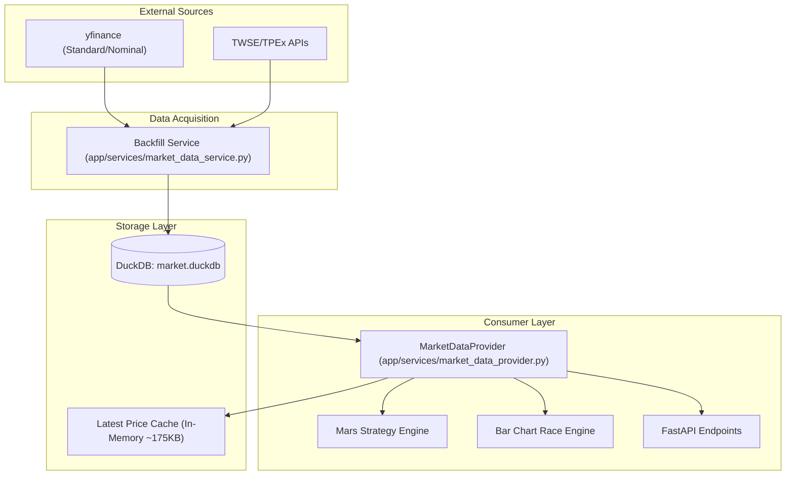

# DuckDB Architecture (v3.0)

**Date**: 2026-02-14
**Status**: DEPLOYED
**Primary Storage**: `data/market.duckdb`

## 1. Overview
As of v3.0, the Martian system has transitioned from a JSON-based memory cache to a **columnar DuckDB DataLake**. This move was driven by the need to:
- Reduce RAM usage on constrained environments (Zeabur).
- Support large-scale, daily-level financial simulations (Mars Strategy).
- Achieve O(1) cold-start performance for the dashboard.

## 2. Component Diagram

## 3. Schema Design

### 3.1 `daily_prices`
Optimized for time-series range queries. Columns are compressed using DuckDB's default encodings.
- `stock_id`: VARCHAR (TICKER)
- `date`: DATE
- `open`, `high`, `low`, `close`: DOUBLE
- `volume`: BIGINT
- `market`: VARCHAR (TWSE/TPEx)

### 3.2 `dividends`
- `stock_id`: VARCHAR
- `year`: INTEGER
- `cash_dividend`: DOUBLE
- `stock_dividend`: DOUBLE

### 3.3 `stocks`
- `stock_id`: VARCHAR (PK)
- `name`: VARCHAR
- `market_type`: VARCHAR
- `industry`: VARCHAR

## 4. Performance Benchmarks

| Metric | Legacy (JSON) | New (DuckDB) | Improvement |
|--------|---------------|--------------|-------------|
| RAM Usage (Idle) | ~2.7 GB | ~50 MB | **98% Reduction** |
| Cold Start Time | ~120s | < 2s | **60x Faster** |
| ROI Simulation (Top 200) | ~36s | ~1.5s | **24x Faster** |
| Storage Format | Uncompressed JSON | Compressed Columnar | ~4x Savings |

## 5. Maintenance & Operations
- **Standard**: All history is stored in **NOMINAL** prices. Adjustments are performed at runtime by the `SplitDetector`.
- **Integrity Checks**: Use `scripts/ops/verify_integrity.py` to ensure daily row continuity.
- **Statistics**: `/api/admin/market-data/stats` provides live monitoring of row counts and DB size.
