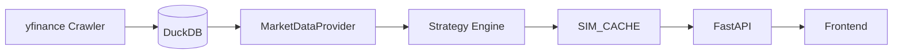

# Feature Specification: Mars Strategy & Bar Chart Race (BCR)

**Owner**: [PL] / [SPEC]
**Version**: 3.1 (Export Rework)
**Last Updated**: 2026-02-28

## 1. Feature Overview

### 1.1 Mars Strategy Tab
The **Mars Strategy** is the primary analysis engine for the Marffet Investment System. it performs high-fidelity historical simulations to rank stocks based on their ability to accumulate wealth over long periods.

*   **Goal**: Find "Survivors" that deliver consistent CAGR and high final wealth.
*   **Input**: Start Year (2000+), Initial Capital, Annual Contribution.
*   **Output**: Ranked table of stocks with Final Wealth, CAGR %, and Volatility %.
*   **Detail View**: Interactive modal showing a 20+ year wealth accumulation chart and comparison between `Buy At Open (BAO)`, `Buy At High (BAH)`, and `Buy At Low (BAL)` strategies.
*   **Export**: Excel download of simulation results. See §1.1.2 below.

#### 1.1.1 Filter Logic (Quality Control)
To ensure high-quality recommendations, the system applies the following filters:
1.  **Active Status**: Stock must have data in the current year.
2.  **Duration**: Simulation must validly cover > 3 years.
3.  **Volatility**: Volatility must be < 3x TSMC (2330).
4.  **Stability**: CAGR Standard Deviation must be <= 20.
5.  **ETF Exclusion**: Excludes Leveraged ETFs (ending with 'L').

#### 1.1.2 Export Specification
The export downloads all simulated targets as an Excel file (`.xlsx`). **No top-50 limit applies.**

| User Tier | Available Modes | Filename |
| :--- | :--- | :--- |
| **Free** | 📦 Unfiltered (raw order, all targets) | `stock_list_s{start}e{end}_unfiltered.xlsx` |
| **Premium** | 📥 Filtered (sorted by Final Wealth) + 📦 Unfiltered | `stock_list_s{start}e{end}_{filtered|unfiltered}.xlsx` |

- **Filtered**: All targets sorted by Final Wealth descending.
- **Unfiltered**: All targets in raw calculation order.
- The premium flag is read from `localStorage` (`marffet_premium`) on the client side.

### 1.2 BCR (Bar Chart Race) Tab
The **Bar Chart Race** provides a dynamic, animated visualization of the wealth trajectories for the top candidates identified in the Mars Strategy.

*   **Goal**: Gamify the visualization of wealth accumulation "leaders" over time.
*   **Visualization**: Dynamic horizontal bars that move and re-rank year-by-year.
*   **Controls**: Play/Pause, Timeline Slider, Speed control.

---

## 2. Software Stack

| Layer | Component | Technology | Role |
| :--- | :--- | :--- | :--- |
| **Frontend** | **Framework** | Next.js 16 (React 18) | Component architecture & App routing. |
| | **Runtime** | **Bun** | Ultra-fast JS runtime and dependency management. |
| | **Styling** | Vanilla CSS + Tailwind | Cyberpunk theme (Cyan/Gold) with glassmorphism. |
| | **Viz** | ECharts (Apache) | High-performance canvas-based rendering for animations. |
| **Backend** | **Framework** | FastAPI (Python 3.12) | High-performance async API layer. |
| | **Runtime** | **uv** | Python package manager and isolated environment runner. |
| | **Data Lake** | **DuckDB** | Columnar storage for 2M+ rows of price & dividend data. |
| | **Simulation** | Pandas + NumPy | Optimized vectorized simulation logic. |
| | **Cache** | In-Memory (Dict) | `SIM_CACHE` for O(1) response on repeated queries. |

---

## 3. System Architecture

### 3.1 Data Flow
The system follows a **Crawl → Store → Simulate → Cache** pipeline:

### 3.2 Key Architectural Patterns
1.  **Columnar Data Access**: Market prices are stored in DuckDB. The engine performs bulk data loading in a single query per simulation run, avoiding N+1 lookup overhead.
2.  **Event-Driven ROI (Clean Room Logic)**:
    -   Simulates using **Nominal Prices** (unadjusted).
    -   Applies stock dividends and splits at runtime using a `SplitDetector`.
    -   This ensures 100% correlation with real-world share accumulation (Physics of Finance).
3.  **Simulation-First Cache**: The result of a Mars Strategy run (expensive ~12s) is cached. The BCR tab and Export Excel feature reuse this cache to provide instant responses.
4.  **Vectorized Processing**: Split detection and statistics (CAGR/Volatility) are computed using NumPy arrays instead of Python loops, enabling the system to process 1,600+ stocks in under 15 seconds.

---

## 4. Logical Functions Needed

| Function | Module | Description |
| :--- | :--- | :--- |
| `MarsStrategy.analyze()` | `strategy_service.py` | Orchestrates the bulk loading and async simulation for the entire universe. |
| `calculate_complex_simulation()` | `roi_calculator.py` | The "Physics" engine. Replays 20+ years of prices, applying investments and corporate actions. |
| `SplitDetector.detect_splits()` | `split_detector.py` | Identifies historical splits/dividends from price anomalies and corporate action tables. |
| `get_race_data()` | `main.py` | Flattens cached simulation data into time-series frames for ECharts animation. |
| `api_export_excel()` | `main.py` | Converts cached results into a multi-sheet Excel report. Mode: `filtered` (sorted) or `unfiltered` (raw). No top-50 limit. |

---

## 5. Deployment & Persistence
*   **Infrastructure**: Zeabur (Containerized).
*   **Market Persistence**: `/data/market.duckdb` is stored on a persistent volume.
*   **Backup**: `portfolio.db` (SQLite) is automatically backed up to GitHub daily.
